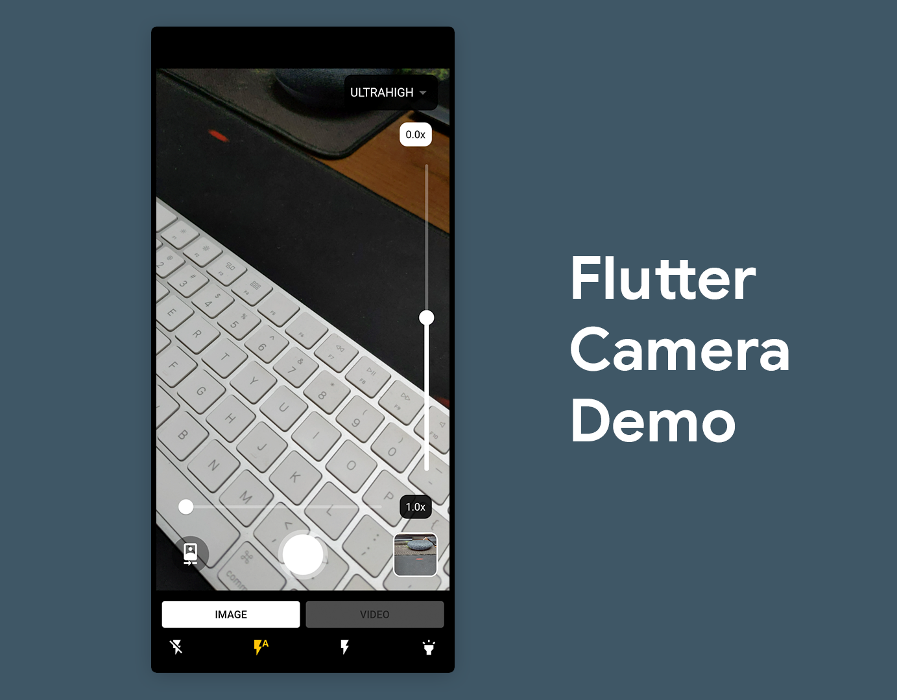

# Flutter YOLO Object Detection Demo

This is a Flutter application that demonstrates real-time object detection using the YOLO (You Only Look Once) model on a live camera stream. The app is built for both Android and iOS platforms.



## Features

*   **Real-time Object Detection:** Identifies and locates objects in the camera feed in real-time.
*   **Live Camera Preview:** Displays a full-screen live feed from the device's camera.
*   **Bounding Boxes:** Draws bounding boxes around detected objects.
*   **Class and Confidence:** Shows the class label and confidence level for each detection.
*   **Inference Latency:** Displays the model's inference time in milliseconds.
*   **Adjustable Confidence Threshold:** A draggable slider allows you to change the confidence threshold for detections dynamically.
*   **Cross-Platform:** Runs on both Android and iOS.

## Getting Started

### Prerequisites

*   Flutter SDK: Make sure you have the Flutter SDK installed. For installation instructions, see the [official Flutter documentation](https://flutter.dev/docs/get-started/install).
*   An Android or iOS device, or a simulator/emulator.

### Installation

1.  **Clone the repository:**
    ```bash
    git clone https://github.com/your-username/flutter_camera_demo.git
    cd flutter_camera_demo
    ```

2.  **Install dependencies:**
    ```bash
    flutter pub get
    ```

## Usage

1.  **Connect a device:** Connect your Android or iOS device, or start an emulator/simulator.

2.  **Run the app:**
    ```bash
    flutter run
    ```

The application will launch on your device, and you should see the live camera feed with object detection in action.

## Models

This application uses the following YOLO models in TensorFlow Lite (`.tflite`) format:

*   `yolo11n_416_float32.tflite`
*   `yolo11n_416_float16.tflite`
*   `yolo11n_float32.tflite`
*   `yolo11n_float16.tflite`

The models are located in the `assets/data` directory.

## Key Dependencies

*   [`camera`](https://pub.dev/packages/camera): For accessing the device's camera.
*   [`tflite_flutter`](https://pub.dev/packages/tflite_flutter): A Flutter plugin for TensorFlow Lite.
*   [`image`](https://pub.dev/packages/image): Provides image processing functionalities.
*   [`path_provider`](https://pub.dev/packages/path_provider): For finding commonly used locations on the filesystem.

## License

This project is licensed under the terms of the LICENSE file.
